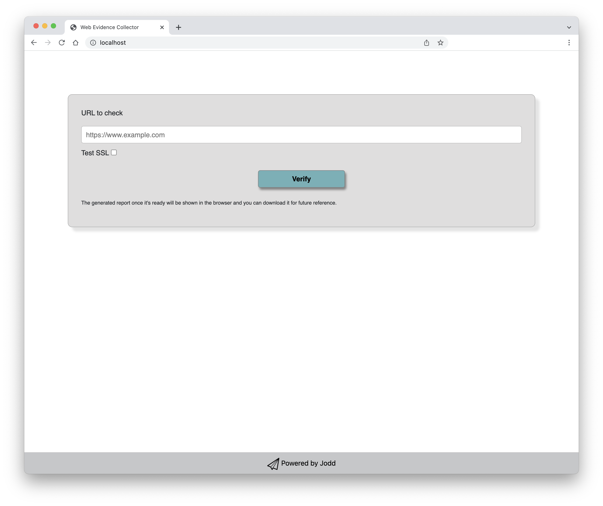
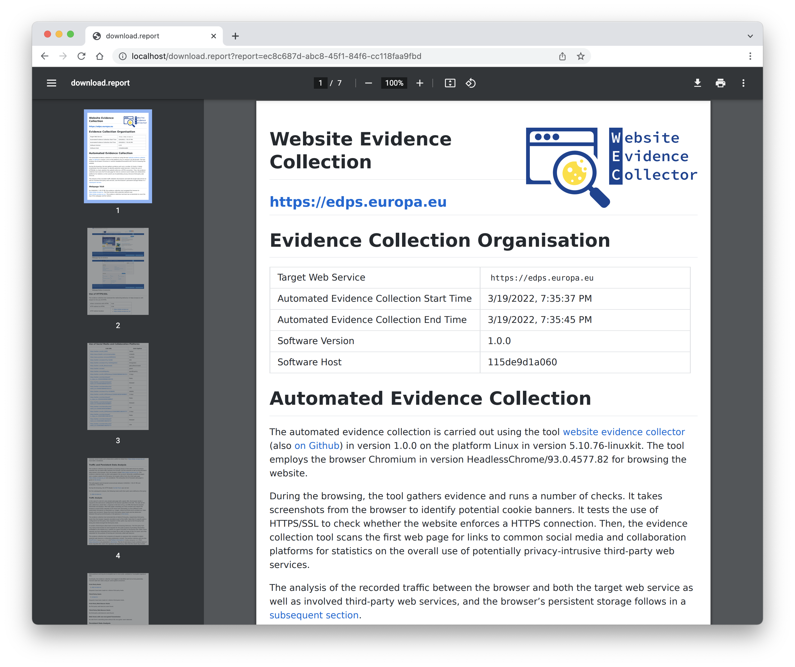

## Website Evidence Collector Web UI

This application is a frontend to integrate with the Docker image of **Website Evidence Collector** ([https://github.com/EU-EDPS/website-evidence-collector](https://github.com/EU-EDPS/website-evidence-collector)) created by [European Data Protection Supervisor](https://edps.europa.eu/)

### About the application

It is a Java based Web Application that requires Tomcat 9.0.5x to run with JDK 8. It is pretty simple, it passes the URL specified by the user to the back-end (Website Evidence Collector). With a small customization in the original code, it can render a PDF report for the user and clean up the output folder to not store any data on the server once the request is served.

**UI off the application**

**Report display**

### About the author

Vilmos Papp (Papp György Vilmos) currently works at Liferay Hungary Kft. and acts as the Team Lead of Escalation Engineers. He has 20+ years experience in Java based Software Development. He started this project with Tibor Antal from [atasi.org](https://atasi.org) who highlighted that Website Evidence Collector could be a great help for the small and mid sized companies in Hungary to verify their websites to see whether they have some todo left to be compliant with GDPR or not, but using it requires someone with deeper IT skills to make it work, so a simpler way e.g.: a website where the url of the site to verify could be passed and the report could be retrieved as a single PDF for later analysis. That is could be covered with this project.

